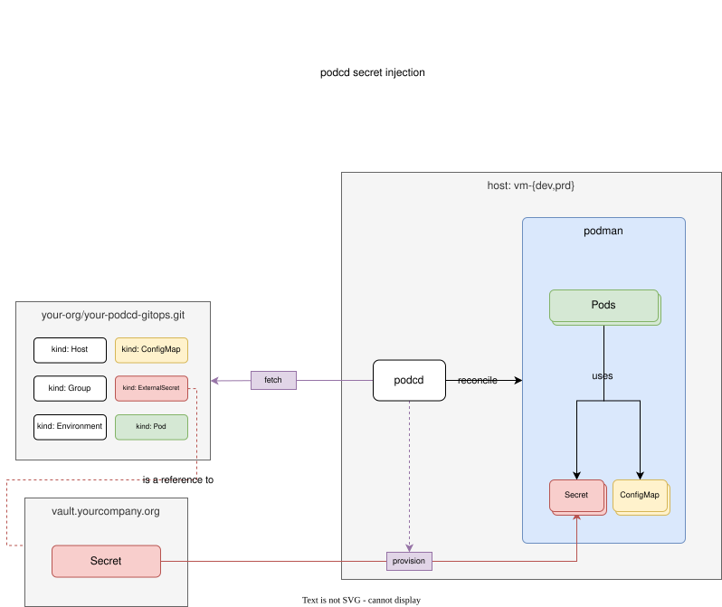

<p align="center">
  <picture>
    <source media="(prefers-color-scheme: dark)" srcset="assets/logo-dark.svg">
    
  </picture>
</p>

<p align="center">A Git-driven reconciler for Linux workloads.</p>
<p align="center"><a href="https://podcd.github.io/podcd/">Documentation</a></p>

podcd reconciles a Linux host to match what is declared in Git.

- Git defines the desired state.
- A local agent reads that state and identifies the host.
- The agent compiles the resulting configuration.
- Quadlet and systemd manage the running containers.

## Quick Start

Install the binary.

```bash
V=3.0.0; A=amd64   # or arm64
curl -fsSLO "https://github.com/podcd/podcd/releases/download/v$V/podcd_${V}_linux_${A}.tar.gz"
curl -fsSLO "https://github.com/podcd/podcd/releases/download/v$V/podcd_${V}_linux_${A}.tar.gz.sha256"
sha256sum -c "podcd_${V}_linux_${A}.tar.gz.sha256" && tar -xzf "podcd_${V}_linux_${A}.tar.gz"
sudo install -m 0755 podcd /usr/local/bin/podcd
```

Create config pointing `podcd` to a git repo.
```bash
podcd config create --host <this_is_optional> --repo-url <repo> --revision main
```

Use `podcd` to provision the systemd service
```bash
podcd install
```

Start the service
```bash
systemctl --user daemon-reload && systemctl --user enable --now podcd-agent.service
```

```bash
podcd logs  # opens podcd-agent.service logs
```

To setup a `podcd` gitops repository you can refer to the following documents:
* [Basic Documents](https://podcd.github.io/podcd/configuration/model)
* [Templating](https://podcd.github.io/podcd/configuration/values)
* [Secrets](https://podcd.github.io/podcd/configuration/secrets)

```text
Usage:
  podcd [flags]
  podcd [command]

Available Commands:
  completion  Generate the autocompletion script for the specified shell
  config      view or create the agent config file
  create      print a validated document for the repository
  get         list what a repository defines
  health      report what podman says about the applications this host runs
  help        Help about any command
  init        scaffold a minimal repository
  install     write the systemd user service file that runs the agent
  lint        check repository files without fetching or touching the host
  logs        recent log output for the agent, or for one application
  options     print the list of flags inherited by all commands
  plan        what would change, without changing anything
  prune       remove what podcd manages here but Git no longer declares
  reconcile   make this host match Git
  remove      stop and remove applications directly, without consulting Git
  run         reconcile in a loop (this is what the systemd service runs)
  status      what this host is running and when it last reconciled
  teardown    stop and remove everything podcd runs on this host, and uninstall the agent
  uninstall   stop the agent's systemd user service and remove its unit file
  validate    load Git and compile the configuration for a host
  version     print the version

Flags:
  -h, --help   help for podcd

Use "podcd [command] --help" for more information about a command.
```

### Shell completion

```bash
# bash
podcd completion bash | sudo tee /etc/bash_completion.d/podcd > /dev/null
# zsh
mkdir -p ~/.zsh/completions && podcd completion zsh > ~/.zsh/completions/_podcd
# then add ~/.zsh/completions to fpath before compinit
```

fish and PowerShell: `podcd completion --help`.

### Container image

```bash
make image                                              # builds podcd:$(VERSION) from Containerfile
podman run --rm -v /repo:/repo:ro,Z ghcr.io/podcd/podcd:latest lint /repo
```

The image runs as a fixed non-root UID (1000); rootless Podman remaps that into your subordinate uid/gid range the same way it does for any other container, nothing special to configure here.

On SELinux-enforcing hosts (RHEL, Fedora), add `:z` (shared) or `:Z` (private) to any bind mount as above, or the mount is denied - Debian/Ubuntu/Alpine don't need this since they don't enforce SELinux.

## Configuration model

podcd reads documents from one or more Git repositories. All config documents share the same API version:

```yaml
apiVersion: gitops.podcd.io/v1
```

The core document types are:

- `Environment`: values that apply broadly to a whole environment
- `Group`: a role or machine-purpose definition
- `Host`: a specific VM, including its environment, groups, and overrides
- `Pod`: a workload definition referenced by name

### Host example

```yaml
apiVersion: gitops.podcd.io/v1
kind: Host
metadata:
  name: local
spec:
  environment: local
  groups:
    - local
```

### Pod example

A workload is a plain Kubernetes `Pod`, played by podman through a Quadlet `.kube` unit. Pods are validated before anything is written: referenced ConfigMaps and Secrets must exist or be marked optional, and host ports must not clash.

```yaml
apiVersion: v1
kind: Pod
metadata:
  name: metrics
spec:
  containers:
    - name: collector
      image: docker.io/library/nginx@sha256:72ba65eb42c10344912a84ff42408db7d34f2feb642204570ab8fc5ffd29f1d3
      envFrom:
        - configMapRef: { name: metrics-config }
      ports:
        - containerPort: 9200
          hostPort: 9200
      livenessProbe:
        httpGet: { path: /ready, port: 9200 }
```

podman runs the `livenessProbe` and reports the verdict; podcd reads it back and never probes anything itself. `readinessProbe` and `startupProbe` are ignored by podman. Networks have no Kubernetes field, so podcd takes them as an annotation - `io.podcd.networks: "edge,monitoring"` - and turns them into the unit's `Network=` lines.

Secrets are declared in Git as `ExternalSecret` + `SecretStore` documents and fetched while the workload is compiled. The pod references them by name via `secretKeyRef` or `envFrom: secretRef` as normal Kubernetes API. See [Secrets](https://podcd.github.io/podcd/docs/configuration/secrets).

<p align="center"></p>

### Inheritance and merge rules

Precedence runs from lowest to highest:

```text
Pod -> Environment override -> Group overrides -> Host override
```

Groups are applied in the order listed by the host, so later entries win. An override is a strategic merge patch against the Pod, so it follows Kubernetes' own rules: containers merge by `name`, ports by `containerPort`, environment variables by `name`, and a plain list is replaced wholesale.

The final application set is the union of what the environment, groups, and host request, minus any exclusions from the host, sorted by name.

Two compiler runs on the same commit produce the same bytes. Ambiguity is treated as an error, not a guess. Examples include:

- an application defined twice across repositories
- a reference to a missing application
- an unknown group
- a host with no `Host` document
- a misspelled field
- two applications contending for the same host port

Each failure names the offending file and explains the issue clearly.

### Multiple repositories

Repositories are composed into one desired state. A name defined twice across them is an error, not a race; `revision` may be a branch, a tag or a commit.

```yaml
repositories:
  - name: infrastructure
    url: https://github.com/podcd/podcd.git
    revision: main
    path: examples
  - name: applications
    url: https://github.com/your-user/applications.git
    revision: v1.4.0
```

### Values templating

Overrides parametrize one application by its name as key, an override can only name an application every host in that layer actually runs.

Values templating parametrizes the documents as well, so several hosts can share one `Pod` definition and each fill in the parts that differ.

A template is a file named `*.tpl` (e.g. `edge-api.yaml.tpl`). A template is rendered for each host against that host's values and only then decoded.

Templates may render any deployable kind - `Pod`, `ConfigMap`, `Secret` - but not `Host`, `Group` or `Environment`, since those are what decide a host's values in the first place.

```yaml
# apps/edge-api.yaml.tpl
apiVersion: v1
kind: Pod
metadata:
  name: edge-api
spec:
  containers:
    - name: edge-api
      image: "{{ .Values.image.repository }}:{{ .Values.image.tag }}"
      resources:
        limits:
          memory: "{{ default \"256Mi\" .Values.resources.memory }}"
```

#### Where values come from

A `Host`, `Group` or `Environment` document names its own values files, merged into that host with exactly the precedence overrides already use - environment, then each group in the host's listed order, then the host itself, host winning:

```yaml
# environments/prod.yaml
apiVersion: gitops.podcd.io/v1
kind: Environment
metadata:
  name: prod
spec:
  applications: [edge-api]
  values:
    - values/prod.yaml   # repeatable; later files in the list win per key
```

Example values:

```yaml
# values/prod.yaml
image:
  repository: registry.example.com/edge-api
  tag: "1.4.0"
resources:
  memory: 512M
```

`agent.yaml`'s `repositories[].values` adds a lowest-precedence layer, resolved on the host. Use it for host-local fallbacks; prefer declaring values in `Host`/`Group`/`Environment` documents.

```yaml
repositories:
  - name: gitops
    url: https://github.com/your-user/podcd-gitops.git
    revision: main
    values:
      - values/common.yaml
```
See [`podcd-gitops/multi-env`](https://github.com/podcd/podcd-gitops/tree/main/multi-env) for a complete example.

#### Functions

Go's `text/template`, plus:

| Function | Use |
|---|---|
| `default DEF VAL` | `VAL` if set, else `DEF`. For anything genuinely optional. |
| `required MSG VAL` | `VAL` if set, else fails the render with `MSG`. Per host: a host that never selects the application never renders its template, so only hosts that actually need the value have to supply it. |
| `upper`, `lower`, `trim` | The obvious string transforms. |
| `trimPrefix P S`, `trimSuffix SUF S` | Strip a fixed prefix/suffix from `S`. |
| `replace OLD NEW S` | `strings.ReplaceAll`. |
| `quote V` | Go-quote a value, for embedding it as a JSON/YAML string literal. |


## Testing

```bash
make test           # unit tests; also runs podman's Quadlet generator over rendered units
make test-e2e       # real podman, quadlet and systemd on this machine (starts containers)
make lint           # golangci-lint
```

## Security

Report security issues through [GitHub's private vulnerability reporting](https://github.com/podcd/podcd/security/advisories/new).

## Contributing

See [Contributing](docs/docs/community/contribution.md).

## License

MIT. See [LICENSE](LICENSE).
