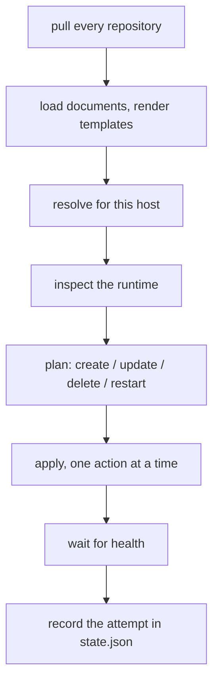

What one reconcile does, in order, and what the agent keeps on the host. `podcd plan` and `podcd reconcile` run exactly this; the agent loop (`podcd run`, what the systemd service runs) repeats it every `interval`.



## Pull

Every repository in `agent.yaml` is fetched at its `revision` (a branch, a tag or a commit). If a remote is unreachable and a checkout already exists on disk, the agent reconciles from the commit it has and reports the repository as offline: reconciling from a slightly old commit beats taking applications down because a network hiccuped.

## Load and resolve

The checkouts are read into one index. A name defined twice across repositories is an error, not a race. The index is then compiled for *this* host - the `Host` document matching `agent.yaml`'s `host` (default: the machine's hostname) - into a fully resolved desired state: the union of what its `Environment`, `Group`s and the `Host` itself select, minus exclusions, with every override and every `*.tpl` template applied. See the [configuration model](configuration/model.md) and [values templating](configuration/values.md).

Nothing downstream deals with inheritance. By the time planning starts, every application carries its final configuration.

## Inspect

The runtime (rootless Podman via Quadlet) is inspected: which units podcd wrote, their content hashes, whether systemd reports them active, which container image is actually running. Units podcd did not write are never touched - if a desired application's unit exists but was not written by podcd, that is an error, not a guess.

## Plan

Desired and actual are compared per application:

- not present on the host → **create**
- the rendered unit differs from the one on disk, or a secret value changed → **update**
- present and unchanged, but the unit is not active → **restart**
- present in the runtime but no longer declared in Git → **delete** (only when `prune` is on, the default; otherwise reported as a no-op, never hidden)

Deletes are ordered before creates, so a renamed application frees its host port before its successor binds it. `podcd plan` prints this plan, with a line-level diff for updates, and changes nothing.

## Apply

Actions run one at a time, under a file lock, so a human running `podcd reconcile` and the agent's own loop cannot fight over the same unit files. A destructive action is logged before it happens. The first failure stops the run and is recorded.

## Health

After applying, every desired application is probed. Applications that just changed are waited on - retried at the healthcheck's `interval`, up to `retries` - the rest are checked once. Any unhealthy application fails the reconcile. `podcd health` runs just this step, and exits non-zero if anything is unhealthy, so it works as a monitoring check.

## Retry

A failed reconcile is retried after `retryInterval`, doubling on each further failure up to `maxRetryInterval`, then the regular `interval` resumes once a reconcile succeeds. `jitter` adds a random delay on top of `interval` so a fleet does not hit Git in lockstep.

## State and history

The agent stores local state in `~/.local/state/podcd/state.json`. It records the agent identity, last revisions, last successful and failed reconciliation, and per-application history including the previous deployment. `podcd status` reads it, so status works offline.

That state is metadata only and is safe to delete. The agent can reconstruct its state from Git and the host.

Everything else the agent owns is under its user's home:

```text
~/.config/podcd/agent.yaml          agent config
~/.config/podcd/agent.env           secrets, 0600, never in Git
~/.config/containers/systemd/       the Quadlet units podcd wrote
~/.local/state/podcd/               checkouts, played manifests, state.json
```
