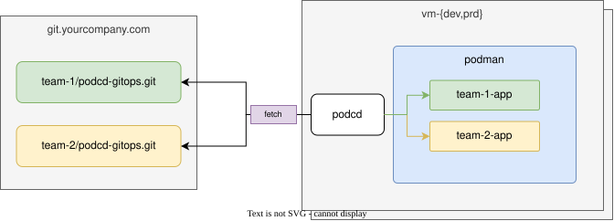

## Overview

#### Fetch

- Every repository in `agent.yaml` is fetched at its `revision` (a branch, a tag or a commit). If a remote is unreachable and a checkout already exists on disk, the agent reconciles from the commit it has and reports the repository as offline.

- The checkouts are read into one index. A name defined twice across repositories will be treated as an error. The index is then compiled for *this* host - the `Host` document matching `agent.yaml`'s `host` (default: the machine's hostname). See the [configuration model](configuration/model.md) and [values templating](configuration/values.md).

- The runtime (currently podman only) is inspected: which units podcd wrote, their content hashes, whether systemd reports them active, which container image is actually running.

#### Plan & Reconcile

Desired and actual are compared per application:

- not present on the host -> **create**
- the rendered unit, or the manifest it plays, differs from what is on disk -> **update**
- present and unchanged, but the unit is not active -> **restart**
- present in the runtime but no longer declared in Git -> **delete** (only when `prune` is on, the default; otherwise reported as a no-op)

Deletes are ordered before creates, so a renamed application frees its host port before its successor binds it.

Reconciles run one at a time under a file lock, so a human running `podcd reconcile` and the agent's own loop cannot fight over the same unit files. A destructive action is logged before it happens. The first failure stops the run and is recorded.

A failed reconcile is retried after `retryInterval`, doubling on each further failure up to `maxRetryInterval`, then the regular `interval` resumes once a reconcile succeeds. `jitter` adds a random delay on top of `interval` so a fleet does not hit Git in lockstep.

#### State and history

The agent stores local state in `~/.local/state/podcd/state.json`. It records the agent identity, last revisions, last successful and failed reconciliation, and per-application history including the previous deployment. `podcd status` reads it, so status works offline.

That state is metadata only and is safe to delete. The agent can reconstruct its state from Git and the host.

Everything else the agent owns is under its running user's home:

```text
~/.config/podcd/agent.yaml          agent config
~/.config/podcd/agent.env           secrets, 0600, never in Git
~/.config/containers/systemd/       the Quadlet units podcd wrote
~/.local/state/podcd/               checkouts, played manifests, state.json
```
