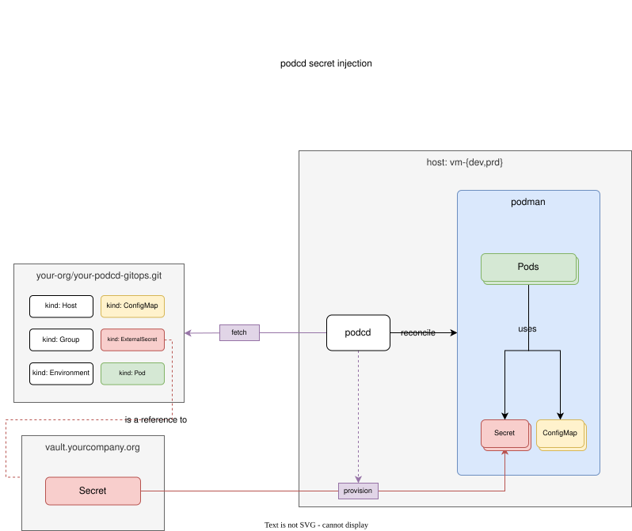

## How it works



Git declares **where** a secret comes from; the agent fetches it on the host at reconcile time and bundles it into the pod manifest.

| Document | What it does |
|---|---|
| `SecretStore` | Configures a backend: the agent's environment, a files directory, or HashiCorp Vault |
| `ExternalSecret` | Names one or more keys to fetch from a store and assemble into a `v1/Secret` |

A host fetches only the secrets its own workloads reference.

## `env` store - secrets from agent.env

Reads variables from the agent's environment and its `envFile`.

```yaml
# In Git: declare the store and what to fetch
apiVersion: external-secrets.io/v1beta1
kind: SecretStore
metadata:
  name: local
spec:
  provider:
    env: {}   # no configuration needed

---
apiVersion: external-secrets.io/v1beta1
kind: ExternalSecret
metadata:
  name: db-creds
spec:
  secretStoreRef:
    name: local
  target:
    name: db-creds        # the Secret name the Pod will reference
  data:
    - secretKey: PASSWORD
      remoteRef:
        key: DB_PASSWORD  # the environment variable name
    - secretKey: USERNAME
      remoteRef:
        key: DB_USER
```

On the host, add the values to `~/.config/podcd/agent.env`:

```bash
sudo -u podcd bash -lc 'umask 077 && cat >> ~/.config/podcd/agent.env' <<'EOF'
DB_PASSWORD=supersecret
DB_USER=app
EOF
```

The file is re-read on every reconcile. Reference the secret from a Pod:

```yaml
# envFrom injects every key as an environment variable
spec:
  containers:
    - name: api
      envFrom:
        - secretRef:
            name: db-creds

# or select individual keys
spec:
  containers:
    - name: api
      env:
        - name: DB_PASSWORD
          valueFrom:
            secretKeyRef:
              name: db-creds
              key: PASSWORD
```

---

## `file` store - secrets delivered by another tool

Reads one file per key from a directory, for when another tool (Vault Agent, a sidecar) writes the files.

```yaml
apiVersion: external-secrets.io/v1beta1
kind: SecretStore
metadata:
  name: secrets-dir
spec:
  provider:
    file:
      dir: /run/secrets/myapp   # absolute, or relative to secretsDir in agent.yaml

---
apiVersion: external-secrets.io/v1beta1
kind: ExternalSecret
metadata:
  name: db-creds
spec:
  secretStoreRef:
    name: secrets-dir
  target:
    name: db-creds
  data:
    - secretKey: PASSWORD
      remoteRef:
        key: db_password        # filename under dir
```

`dataFrom` fetches every file in a directory at once:

```yaml
  dataFrom:
    - extract:
        key: /run/secrets/myapp   # directory; every file becomes one key
```

---

## `vault` store - HashiCorp Vault KV

Server, KV version and auth method live in the `SecretStore`; Vault's own credentials are references resolved from `agent.env`.

```yaml
apiVersion: external-secrets.io/v1beta1
kind: SecretStore
metadata:
  name: vault
spec:
  provider:
    vault:
      server: https://vault.example.com
      kvVersion: 2          # 1 or 2; default 2
      # namespace: team-a  # Vault Enterprise only
      # caCert: /etc/pki/vault-ca.pem
      auth:
        appRole:
          roleId: env:VAULT_ROLE_ID        # resolved from agent.env
          secretRef:
            name: env:VAULT_SECRET_ID      # resolved from agent.env
        # tokenSecretRef:
        #   name: env:VAULT_TOKEN          # alternative to AppRole
```

Add the credentials to `agent.env`:

```bash
sudo -u podcd bash -lc 'umask 077 && cat >> ~/.config/podcd/agent.env' <<'EOF'
VAULT_ROLE_ID=xxxxxxxx-xxxx-xxxx-xxxx-xxxxxxxxxxxx
VAULT_SECRET_ID=yyyyyyyy-yyyy-yyyy-yyyy-yyyyyyyyyyyy
EOF
```

`remoteRef.key` is the full KV path including mount; `property` selects the field:

```yaml
apiVersion: external-secrets.io/v1beta1
kind: ExternalSecret
metadata:
  name: db-creds
spec:
  secretStoreRef:
    name: vault
  target:
    name: db-creds
  data:
    - secretKey: PASSWORD
      remoteRef:
        key: secret/prod/db     # mount/path
        property: password      # field within the KV secret
```

`dataFrom` extracts every field from one KV path:

```yaml
  dataFrom:
    - extract:
        key: secret/prod/db     # all fields become Secret keys
```

The agent logs in on first use, again on token expiry or rejection, and caches reads for 30s, so many keys from one path cost one round trip.

---

## Mounting secrets as files

Standard Kubernetes volume syntax:

```yaml
apiVersion: v1
kind: Pod
metadata:
  name: api
spec:
  volumes:
    - name: db-secret-vol
      secret:
        secretName: db-creds
  containers:
    - name: api
      image: example.com/api@sha256:...
      volumeMounts:
        - name: db-secret-vol
          mountPath: /run/secrets/db
          readOnly: true
```

---

## Git-defined Secrets

A plain `v1/Secret` in Git is bundled into the manifest as written.

## Repository credentials

See [private repositories](../installation.md#private-repositories).
