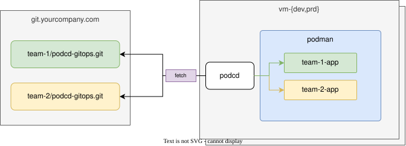

## Fetch

- The repository in `agent.yaml` is fetched at its `revision` (branch, tag or commit). If the remote is unreachable but a checkout exists, the agent reconciles from that commit and reports the repository as offline.
- Every manifest is read into one index; a name defined twice is considered an error. The index is compiled for *this* host: the `Host` document named by `agent.yaml`'s `host` (default: the hostname). See the [configuration model](configuration/model.md) and [values templating](configuration/values.md).
- The runtime (podman or docker) is inspected: which units podcd wrote, their content hashes, whether they are active, which images are running.

## Plan & reconcile

Desired and actual are compared per application:

- not on the host -> **create**
- the rendered unit, or the manifest it plays, differs from disk -> **update**
- unchanged, but the unit is not active -> **restart**
- on the host but no longer in Git -> **delete** (when `prune` is on, the default; otherwise a no-op)

[Networks](configuration/networks.md) go through the same comparison. Deletes run before creates, so a renamed application frees its host port before its successor binds it.

Reconciles run one at a time under a file lock, so `podcd reconcile` and the agent's loop never fight. Destructive actions are logged before they happen. The first failure stops the run and is recorded.

A failed reconcile is retried after `retryInterval`, doubling up to `maxRetryInterval`; after a success the regular `interval` resumes. `jitter` adds a random delay to `interval` so a fleet does not hit Git in lockstep.

## State

`~/.local/state/podcd/state.json` records the host identity, last revisions, last success and failure, and per-application history. `podcd status` reads it, so it works offline. It is metadata only and safe to delete.

Everything the agent owns is under its user's home:

```text
~/.config/podcd/agent.yaml          agent config
~/.config/podcd/agent.env           secrets
~/.config/containers/systemd/       Quadlet units podcd wrote
~/.local/state/podcd/               checkouts, played manifests, state.json
```
